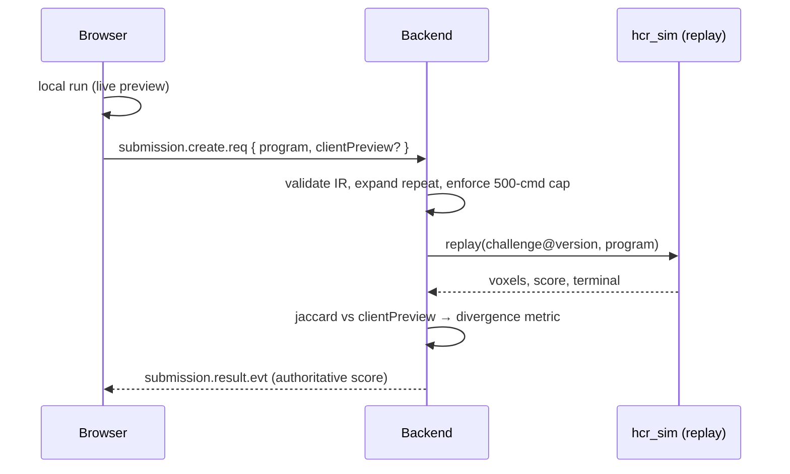

# 02 — Determinism & Authoritative Scoring

> **Revision note.** An earlier draft of this document claimed frame-rate dependence was a blocking
> correctness issue. That was overstated. Worked through with the actual constants (§1), the effect is
> bounded at roughly **one voxel** in the pathological case and effectively zero at normal frame rates, and
> the collision claim was outright wrong (§2). The case for server-side scoring rests on **tamper
> resistance**, not determinism (§3). This document has been corrected.

## 1. How large is the frame-rate effect, actually?

The mechanism is real but small. Voxel contact is evaluated once per tick, treating the end-effector path
from `previousEndEffector` to `currentEndEffector` as a straight segment
(`src/features/simulation/SimulationEngine.ts:339-346` → `src/features/voxel/contactDetection.ts:8-42`),
while a rotating joint actually moves the tool along an arc. The chord/arc gap is the sagitta
`s = r(1 − cos(Δθ/2))`.

What matters is that gap **relative to the test volume**. From `src/data/challenges/defaultChallenge.ts`:

```
voxelConfig.size = 0.16        toolRadius = 0.12
expansion = size/2 + toolRadius = 0.08 + 0.12 = 0.20     // half-extent of the AABB test box
```

The test box is 0.40 across — **2.5 voxels wide**. Worst-case lever arm is `baseYaw` at 60 °/s with the arm
extended (`upperArm 1.05 + forearm 0.9 + tool 0.35 ≈ 2.3`):

| Frame rate | Δθ per tick | Sagitta | % of voxel size | % of test expansion | Expected differing voxels per 1-unit sweep |
| --- | --- | --- | --- | --- | --- |
| 144 Hz | 0.42° | 0.000015 | 0.01 % | 0.008 % | ~0.005 |
| 60 Hz | 1.0° | 0.000088 | 0.05 % | 0.04 % | ~0.03 |
| 30 Hz | 2.0° | 0.00035 | 0.22 % | 0.18 % | ~0.1 |
| 10 Hz (`clampFrameDeltaMs` ceiling) | 6.0° | 0.0032 | 2.0 % | 1.6 % | **~1** |

Expected-count method: voxels flip only if their centre lies in the thin shell the deviation sweeps, so
`N ≈ (2πRL · s) / size³` with `R = 0.20`, `L` = sweep length.

**Conclusion: the voxel grid absorbs the error.** At any interactive frame rate the difference is a
fraction of one block. Only a tab throttled to the 100 ms clamp reaches ~1 voxel — worth ~0.3 % of
Completion, ~0.2 points of Final Score after the 0.6 weight. This is not a correctness problem.

## 2. Collision is frame-rate independent (correction)

`advanceAngleWithConstraint` subdivides **the current tick's** rotation into steps of at most
`MAX_ANGULAR_STEP_DEG = 0.5°` (`src/features/robot/RobotController.ts:181-190`), so angular resolution is a
constant, not a function of `deltaMs`. On the first colliding sub-step it brackets
`[lastSafeAngle, candidateAngle]` — a span of ≤0.5° — and runs `COLLISION_BISECTION_STEPS = 12` bisections,
converging to within `0.5° / 2¹² ≈ 0.0001°` of the true geometric boundary.

A larger tick therefore shifts *where the sub-step grid starts*, but bisection converges on the same true
boundary regardless. `safeAngleDeg` is stable across frame rates to ~10⁻⁴ degrees. The only exception is a
graze that enters and exits contact inside a single 0.5° sub-step, which is equally likely at any frame rate.

## 3. Why the server should still score

The real argument has nothing to do with floating point:

- **The client is untrusted.** It is JavaScript in a browser the player controls. In a ranked competition
  a participant can edit the score, the voxel set, or the metrics in devtools before submitting. No amount
  of simulation determinism changes that.
- **Sessions must be auditable.** Under CAT, a score is evidence for an ability estimate that selects the
  next item. Being able to re-derive any historical score from `(challengeId, challengeVersion, program)` is
  what makes calibration and disputes tractable.

So: submit the **Program IR**, have the server replay it, and treat the server's result as authoritative.
The client's local run stays exactly as it is — a live preview, which is the product.

Anti-tamper does not need bit-exactness. It needs the server to be the one that computes the number.

## 4. Where determinism still matters

Two narrow places, both satisfied without changing the frontend:

1. **Server self-consistency.** The same binary, given the same `(challenge@version, program)`, must produce
   the same result — this is what makes replay caching safe and audits meaningful. Guaranteed by
   construction: the replay engine picks its own fixed tick and no wall clock enters the computation.
2. **Cross-engine agreement, within tolerance.** The Rust replay should broadly agree with the TS engine, so
   that a large divergence signals a genuine porting bug. Given §1, the tolerance is generous.

```
jaccardDistance = |A △ B| / |A ∪ B|
divergedFromClient = jaccardDistance > 0.01     // ~1 % of voxels; well above the ~1-voxel noise floor
```

Exact hash equality between TS and Rust is **not** required and should not be asserted: `computeRobotPose`
uses `Math.sin`/`Math.cos` (`src/features/robot/kinematics.ts:19-91`), and IEEE-754 guarantees correct
rounding for `+ − × ÷ √` but *not* for transcendentals, so V8 and Rust's libm may differ in the last ULP.
Chasing bit-parity would mean writing a shared polynomial `sin_deg`/`cos_deg` in both languages — real work
for no benefit once the server is authoritative.

### 4.1 Cutter Grid raises the bar, and it holds

Cutter Grid changes what cross-engine agreement is worth. On the servo path a divergence is a porting bug
worth investigating; on the Cutter Grid path the server is checking a motion the *browser* computed, so the
two engines have to agree on forward kinematics closely enough that an honest plan is never mistaken for a
fabricated one. That check runs at `1e-6` on the tool tip — several orders tighter than the Jaccard
tolerance above, and far tighter than the ULP-level disagreement the transcendentals actually produce.

This is measured, not assumed. `crates/hcr_sim/tests/cutter.rs` verifies a trajectory produced by the real
browser planner, and the Rust engine independently reproduces its cut exactly: the certified reference
program scores completion 100, meaning every one of the twelve target voxels — and no others — came off
under Rust's own FK, collision test and voxel sweep. Both engines agreeing on a 2 134-waypoint motion to
within `1e-6` is a much stronger statement of parity than the conformance vectors alone make, and it is why
the tolerance can be that tight without being fragile.

One consequence worth stating: a genuine loss of parity would surface as legitimate submissions being
rejected with `END_EFFECTOR_MISMATCH`, not as quietly wrong scores. That is the right failure direction, but
it means the tolerance is a thing to check when either engine's kinematics changes.

## 5. Result hashing

`resultVoxelsHash` identifies an outcome compactly, used for replay caching and for the divergence metric:

1. Take the remaining hair voxel keys as `"{x},{y},{z}"`.
2. **Sort lexicographically by byte value.** JS `Set` iterates in insertion order and Rust `HashSet`
   arbitrarily; neither is canonical. Sorting is what makes the hash comparable at all.
3. Join with `\n`, UTF-8 encode, SHA-256, lowercase hex.

## 6. Replay pipeline



- The server re-expands `repeat` from `Program.nodes` and never trusts a client-supplied
  `runtimeCommands`; the 500-command cap (`programCompiler.ts:12`) is enforced server-side. This is the
  substantive anti-tamper step.
- Replay is CPU-bound — run it off the async runtime with a bounded queue and a 5 s budget
  (`REPLAY_TIMEOUT`), or a maximal-repeat program becomes a DoS primitive.
- Load the challenge at the pinned `challengeVersion` so recalibration never moves a historical score.

## 7. Optional: canonical fixed timestep

A fixed sim step decoupled from rendering is **nice to have, not a prerequisite**:

```ts
export const SIM_TICK_MS = 5;
const MAX_SUBSTEPS_PER_FRAME = 40;
accumulatorMs += clampFrameDeltaMs(delta);
let steps = 0;
while (accumulatorMs >= SIM_TICK_MS && steps < MAX_SUBSTEPS_PER_FRAME) {
  engine.tick(SIM_TICK_MS);
  accumulatorMs -= SIM_TICK_MS;
  steps += 1;
}
```

It would remove the residual ~1-voxel throttled-tab variance and make client and server directly comparable.
Given §1, it is not worth doing on its own — fold it in only if the engine is being touched anyway.

## 8. Note on the competition rule

For a "same time, closest to target wins" format: the Time component of scoring uses
`estimateProgramDuration`, computed **statically from the program** (`src/features/scoring/scoring.ts:53-100`)
rather than from elapsed ticks. Time is therefore measured in *simulated* time and is already frame-rate
independent, so a slower machine is not penalised. Confirm this is the intended reading of "same time" —
if the format ever moves to wall-clock timing, `clampFrameDeltaMs` would start costing stuttering machines
real simulated progress, and that *would* be a fairness problem worth fixing.

## 9. Conformance vectors

Still worth having, now scoped to catching porting bugs in the Rust engine rather than policing the client:

```
docs/backend/conformance/vectors.json   # [{ id, challengeRef, program, expect: { score, terminal, hash } }]
```

Cases: single-joint no-contact FK baseline; a full sweep with known removal count; a program ending in head
collision (pins `safeAngleDeg` and the bisection); motion tangent to the head ellipsoid; nested `repeat`
hitting exactly 500 commands; a zero-duration move (`startAngle == targetAngle`, pinning the
`durationMs === 0` branch at `RobotController.ts:101-102`); empty program (must be rejected at compile);
both hair sets empty (Completion is 100 by SPEC v0.3 §10.3).

Generate from the TS engine — it is the incumbent definition of correct — and require the Rust engine to
match within the §4 tolerance.

Cutter Grid has a second fixture on the same principle, driven by the real browser planner rather than the
real browser engine:

| Fixture | Generator | Asserted by |
| --- | --- | --- |
| `crates/hcr_sim/tests/fixtures/vectors.json` | `tools/generate-vectors.ts` (`npm run vectors`) | `tests/conformance.rs` |
| `crates/hcr_sim/tests/fixtures/cutter-grid-plan-v2.json` | `tools/generate-cutter-grid-plan.ts` (`npm run cutter-grid:plan`) | `tests/cutter.rs` |

Both generators live in `hcr-backend/tools/` and import frontend source directly, but are invoked through a
config in the frontend package — that is where `node_modules` is. Neither joins `npm test`: they write
files, which is not something a test run should do.

The Cutter Grid fixture regenerates byte-identically, which is worth knowing: the ladder planner's Halton
seeding and deterministic farthest-point sampling mean a regenerated plan is the same plan, so a diff after
running the generator is a real change in the planner and not noise.
