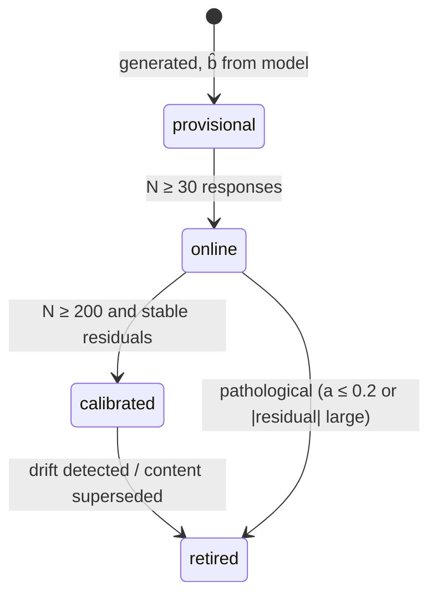

# 03 — Dynamic Question Bank on arona

## 1. Mapping HCR onto IRT

| CAT concept | HCR realization |
| --- | --- |
| Examinee ability θ | Robot-programming proficiency, logit scale |
| Item | A **challenge** (initial hair → target hair, joint set, block budget) |
| Response | The learner's Program IR, replayed server-side |
| Item score | `finalScore / 100`, normalized to `[0, 1]` |
| Item difficulty `b` | How hard that haircut is to program |
| Discrimination `a` | How sharply the item separates ability levels |
| Guessing `c` | ≈ 0 — see below |

**Use 2PL, not 3PL.** arona defaults to 3PL (`arona/src/core/irt.rs:161`), which exists to model
multiple-choice guessing. You cannot guess your way into a correct haircut program: the response space is
effectively unbounded, so `c ≈ 0` and 3PL degenerates to 2PL while adding a noisy parameter that needs far
more data to estimate. Set `guessing: 0.0` and call `probability_2pl` / `information_2pl`
(`irt.rs:259,302`).

## 2. The partial-credit problem, and the workaround

HCR scores are continuous. arona's estimators are not: every one of them collapses the response through
`Score::is_correct()`, which is a hard `> 0.5` test (`arona/src/core/score.rs:143`). Feeding a raw
normalized score in means "mastery" is silently defined as exactly 50/100 — and since `finalScore` is a
weighted blend of completion (0.6), efficiency (0.25) and time (0.15), 50 is not a defensible mastery bar.

**Workaround: an order-preserving remap around a per-item threshold τ.**

```rust
/// Maps raw normalized score s ∈ [0,1] so that s > τ  ⟺  remapped > 0.5.
/// Monotonic, continuous, fixes 0→0, τ→0.5, 1→1.
fn remap_for_arona(s: f64, tau: f64) -> f64 {
    debug_assert!(tau > 0.0 && tau < 1.0);
    if s <= tau { 0.5 * (s / tau) } else { 0.5 + 0.5 * (s - tau) / (1.0 - tau) }
}
```

`τ` is `ChallengeMeta.masteryThreshold` (default 0.5, tunable per item). The **raw** score is persisted
separately in our own store and travels on the wire as `ResponseOutcome.rawScore`, so no information is
destroyed — only what arona sees is thresholded.

**This is a workaround, not a solution.** The principled fix is a polytomous model (GPCM or a graded
response model), which arona does not implement. Recorded as an upstream gap in §10.

## 3. Why a custom `QuestionBank`

`StaticQBank` is fixed at construction with no add/remove (`arona/src/qbank/static_bank.rs:191`), performs
no exposure control, and ignores `SelectionHints.used_types` entirely. Everything that makes a bank
*dynamic* is therefore ours to write. Fortunately `QuestionBank` is object-safe with only three required
methods (`arona/src/qbank/traits.rs:210-300`), so this is the intended extension point rather than a fight
with the library.

```rust
pub struct HcrDynamicBank {
    catalog:   Arc<CatalogSnapshot>,        // immutable snapshot; swapped atomically on catalog change
    generator: Arc<dyn ChallengeGenerator>, // item families, §5
    blueprint: Blueprint,                   // content balancing, §7
    exposure:  ExposureController,          // §6
    served:    Vec<ServedItem>,             // index -> ItemId, in serve order
    used:      HashSet<ItemId>,
    rng:       StdRng,                      // SEEDED per session -> reproducible selection
}

impl QuestionBank for HcrDynamicBank {
    fn select_question(&mut self, hints: &SelectionHints) -> Result<Question, QBankError>;
    fn stats(&self) -> QBankStats;          // all fields are pub; construct directly
    fn reset(&mut self);
    fn last_selected_index(&self) -> Option<usize> { self.served.len().checked_sub(1) }
}
```

Two details that fall out of arona's shape:

- `Question` is **not `Clone`** and `select_question` returns it by value, so the bank constructs a fresh
  `Question::with_tags(Box::new(content), params, tags)` on every call. Our content is a lightweight handle,
  so this is cheap.
- The **seeded RNG matters**: arona's own selectors reach for `rand::thread_rng()`
  (`static_bank.rs:435`), which makes sessions unreproducible. Owning the RNG lets us replay a session
  exactly for debugging and for audit.

### Selection algorithm

```
1. read hints:
     params.get::<MaxInfoParams>()      -> tolerance, min_discrimination
     params.get::<NearestDiffParams>()  -> range          (fallback strategy)
     target_difficulty                  -> b*
     used_types                         -> per-dimension counts served so far
     user_field                         -> target skill dimension (multi-dim mode, §8)
2. candidate filter:
     not in `used`
     calibration != Retired
     a >= min_discrimination
     blueprint allows this dimension right now
     exposure controller permits it
3. rank by Fisher information at θ:  q.parameters.information(theta)   // arona provides this
4. randomesque: take top-k (k = 5), sample weighted by information
5. if the candidate set is empty within the difficulty band -> GENERATE (§5)
6. if generation is impossible    -> Err(QBankError::NoQuestionAvailable)
7. record ServedItem{ item_id, version, index }, return Question
```

Step 4 is the exposure mechanism arona lacks: always taking the single most informative item would serve the
same handful of items to everyone near the same θ, burning the bank and making the assessment predictable.

### `QuestionContent` implementation

```rust
#[derive(Debug, Clone)]
pub struct ChallengeContent {
    item_id: ItemId,
    version: u32,
    mastery_threshold: f64,
    /// Filled in by the session actor once the submission has been replayed.
    outcome: Option<ReplayOutcome>,
}

impl QuestionContent for ChallengeContent {
    fn render(&self, _f: RenderFormat) -> String { /* item handle, not display text */ }
    fn score(&self, answer: &str) -> Score {
        // `answer` is the submissionId; the replayed raw score is looked up and remapped.
        Score::new(remap_for_arona(self.outcome_raw(answer), self.mastery_threshold))
    }
    fn guessing_probability(&self) -> f64 { 0.0 }
    fn generate_feedback(&self, _a: &str, _s: Score) -> String { /* … */ }
    fn clone_box(&self) -> Box<dyn QuestionContent> { Box::new(self.clone()) }
}
```

Note the indirection: arona calls `score(answer)` synchronously, but replay is asynchronous and expensive.
So the session actor **replays first**, attaches the outcome to the content, and only then calls
`submit_response(submission_id)`. `score()` never blocks and never computes.

## 4. Item identity

arona items have no ID and are addressed by `Vec` index (`arona/src/core/question.rs:159-165`), which is a
poor fit for a bank whose contents change. The bridge:

- `HcrDynamicBank.served` maps serve-order index → `(ItemId, version)`.
- `Session::last_selected_index()` gives the index just served (`session.rs:336`).
- That pair is sealed into the `itemRef` HMAC token (see [`01-CONTRACT.md`](01-CONTRACT.md) §6.3), so the
  client round-trips the mapping without being able to forge it.
- `reset()` clears `served`; index space is per-session, never global.

## 5. Item families: what makes the bank "dynamic"

An HCR challenge is **parametric** — robot config, voxel grid, initial/target hairstyle, allowed blocks,
scoring weights. The hairstyles themselves are already generated procedurally
(`src/features/voxel/hairGenerator.ts:12-28`). That makes automatic item generation natural here in a way it
rarely is for text items.

```rust
pub struct ItemFamily {
    pub family_id: String,
    pub version: String,                     // bump ⇒ all instances re-enter calibration
    pub dimensions: Vec<SkillDimension>,
    pub params: Vec<ParamSpec>,              // named, with sampling ranges
    pub predicted_difficulty: DifficultyModel,   // §6
    pub hardware_compatible: bool,
}

pub trait ChallengeGenerator: Send + Sync {
    /// Deterministic: (family, seed, params) -> identical challenge, everywhere, forever.
    fn generate(&self, family: &ItemFamily, seed: u64, params: &ParamVector)
        -> Result<ChallengeDefinitionDto, GenError>;
    /// Find a parameter vector whose predicted b lands near the target.
    fn solve_for_difficulty(&self, family: &ItemFamily, target_b: f64)
        -> Option<(u64, ParamVector)>;
}
```

Determinism is non-negotiable: an item is identified by `(familyId, version, seed, params)`, and the
challenge served today must be byte-identical to the one replayed next year during an audit. Provenance
travels in `ChallengeMeta.generator`.

### Targets are derived from a program, never drawn

A generated target must be **reachable and solvable**, and geometry alone cannot promise either. The
`cap-trim` family originally drew the trim sector on the head ellipsoid and called that the target. Nothing
checked the arm could get there, and it could not — measured across the shipped bank:

| Item | Asked to remove | Arm can ever reach | Best achievable | Doing nothing |
| --- | --- | --- | --- | --- |
| `Cap Trim 30%` | 91 | 20 | 77.95 | 73.39 |
| `Cap Trim 72%` | 284 | 145 | 79.53 | 65.53 |
| `Cap Trim 94%` | 345 | 232 | 15.67 | 5.74 |

No learner could score 100 on any of them, and on the first two the entire reward for skilled play was ~5
points. Such items also carry almost no measurement signal: responses compress into a narrow band, so
discrimination collapses and calibration learns nothing.

So the order is inverted. The generator derives a **reference program** from the item's parameters, replays
it through `hcr_sim`, and adopts whatever hair it leaves standing as the target. The item is then winnable
by construction — the reference scores exactly 100, because the target is defined as its result. This is the
rule the authored challenge and the eight lessons already follow.

Three gates enforce it, in order of increasing distrust:

1. `derive_reference` keeps only the longest prefix of the reference that **runs to completion**, so a sweep
   the head constraint stops can never define a target.
2. `generate` re-scores the reference against the finished challenge and refuses to emit unless completion
   is exactly 100 (`GenError::UnreachableSector`). The construction should make this redundant; "should" is
   how the unwinnable bank shipped.
3. `generate` refuses items whose reference removes less than `MIN_REMOVAL_FRACTION` (2%) of the hair
   (`GenError::MarginTooSmall`). Completion is an IoU over remaining hair, so a 2-voxel trim out of 342
   scores 99.42 for doing nothing — reachable, but worth 0.58 points and measuring nobody.

The starter workspace is the reference with its carving removed: it positions the tool over the crown and
stops, leaving the sweep for the learner. Shipping the sweep too would hand over the answer.

### Authored targets: the dead-zone audit

Derivation only covers *generated* items. An authored challenge — the shipped one, the eight lessons,
anything added by hand — has no reference to derive from, so it is audited from the other direction by
`HCR_Simulator_Frontend/tests/unit/reachability.test.ts`: sweep the collision-free joint space, union every
hair voxel the tool passes through, and fail if a target asks for anything outside it.

On the shipped head that dead zone is **94 of 241 voxels (39.0%)** — one solid wedge on the far side from
the arm, worst at the crown, where the elbow meets the skull before the tool arrives.

The two guarantees point opposite ways and neither replaces the other:

| | Proves | Applies to |
| --- | --- | --- |
| Replayed reference | Target **is** solvable | Generated items |
| Dead-zone sweep | Target is **not** solvable | Authored items |

The sweep is necessary, not sufficient: touching every asked voxel in *some* pose is not one program
touching them all, in one run, inside the command budget. It rules targets out; it cannot rule them in.

The sweep costs minutes, so `npm run reachability` caches it to `tests/fixtures/reachability.json`. Each
entry stores a signature over the geometry, servo calibration (`axis`, `centerDeg`, `direction`,
`offsetDeg`), lattice, hair and sampling grid it was measured from, and the
audit **fails on a mismatch instead of trusting the cache** — a reachable set that outlived its geometry
would clear an arm that can no longer reach any of it. The signature deliberately excludes
`initialAngleDeg`: the sweep enumerates each joint's whole range, so a program's opening pose cannot change
which poses exist, and excluding it lets the eight lessons share one measurement. That holds only while the
sweep ignores connectivity between poses; give it a reachable-*from* notion and the start pose becomes an
input again.

Cost: the family now spans roughly `b ∈ [-1.0, +0.2]` rather than a nominal ±3, because deriving targets
from one reference shape makes items resemble each other. Difficulty targeting at the tails leans on
authored items until more families exist. Rejection rate is low — 2 of 300 seeds.

Example families:

| Family | Varies | Primarily measures |
| --- | --- | --- |
| `uniform-trim` | trim depth, region radius | kinematics |
| `asymmetric-crop` | left/right asymmetry, boundary sharpness | precision |
| `banded-fade` | number of bands, gradient steepness | iteration (loops pay off) |
| `tight-clearance` | head clearance margin, approach angle | safety |
| `budget-squeeze` | block budget vs. reference solution cost | sequencing |

## 6. Difficulty model (LLTM-style)

New items need a difficulty estimate before anyone has attempted them. Predict `b` from measurable features
of the challenge:

```
b̂ = β₀ + Σ βₖ · fₖ
```

| Feature | Definition | Rationale |
| --- | --- | --- |
| `f_volume` | `log(voxels to remove)` | Raw workload |
| `f_precision` | boundary voxels ÷ removed voxels | IoU sensitivity — thin targets punish sloppiness |
| `f_clearance` | min head clearance along a reference solution ÷ `headClearance` | Collision risk |
| `f_reach` | fraction of target voxels needing \|joint\| > 70 % of range | Reachability strain |
| `f_dof` | number of joints that must move; `shoulderRoll` weighted higher | 3D side-tilt is a step change in difficulty |
| `f_budget` | `referenceProgramCost ÷ allowed block budget` | Efficiency pressure |
| `f_loop` | 1 if the target is unreachable within budget without `repeat` | Demands abstraction |
| `f_asym` | target asymmetry measure | Symmetric crops are easier to reason about |

Bootstrap `β` from expert judgement, then refit by regressing calibrated `b` on features once enough items
have data. `a` starts at 1.0.

The reference solution needed by `f_clearance`, `f_budget` and `f_loop` comes from a solver run at
generation time — it is a search over the challenge's own command space, not a learned model. Items whose
reference solver fails to find any solution must be **rejected at generation**, never served.

## 7. Calibration, exposure, blueprint

### Calibration lifecycle



- **provisional** — `b̂` from the model, exposure-capped, and **excluded from θ updates that count**
  (served, scored, and recorded, but flagged so a high-stakes score never rests on an uncalibrated item).
- **online** — refit `b` by 1-D Newton on the marginal likelihood with θ fixed at posterior means. This is
  the standard "θ-known" online calibration and is cheap enough to run incrementally.
- **calibrated** — periodic batch MMLE/JMLE offline; publishing new parameters **bumps
  `challengeVersion`** (decision D7), so historical scores never move.
- Drift monitoring compares observed vs. expected `p` per item; sustained residuals retire the item.

arona has no calibration machinery at all — all of the above is backend-owned.

> Responses arrive from **two modes** (solo CAT and competitive rounds) whose conditions differ, so they
> cannot be pooled directly. The common-scale-with-mode-offset design that makes both usable — and that
> lets competitive rounds calibrate the solo bank — is [`07-CALIBRATION.md`](07-CALIBRATION.md).

### Exposure control

Also absent from arona (only within-session no-repeat exists). Two layers:

1. **Randomesque top-k** (§3 step 4) — cheap, effective, no tuning.
2. **Sympson–Hetter** for high-stakes use: each item carries an exposure probability `P(admin | selected)`,
   tuned offline so no item exceeds a target rate `r_max` (e.g. 0.2).

### Blueprint / content balancing

`SelectionHints.used_types` is a `HashMap<String, u32>` intended for exactly this and is simply never read
by `StaticQBank` (`arona/src/selection/hints.rs:111-117`). Our bank honours it: given target proportions per
`SkillDimension`, filter out dimensions that are already over quota, then rank by information within what
remains. This is standard constrained CAT and costs almost nothing once the field is actually consulted.

## 8. Multidimensional ability — two options

arona's θ is a scalar; HCR proficiency is not. Options:

| Option | How | Verdict |
| --- | --- | --- |
| **A. Single composite θ** | One `Session`. Record dimension tags on every response for reporting only | **Recommended for v1.** Simple, matches arona natively, produces a defensible overall score |
| B. Parallel unidimensional sessions | One `Session` per dimension; each item selected for the dimension with the largest SE; `user_field` set to that dimension | Approximates MIRT without MIRT. More items needed (each θ needs its own evidence) |

Option B has a free lever: arona applies a 1.3× information boost when an item's tags match
`SelectionHints.user_field` (`static_bank.rs:322-328`). Setting `user_field` to the currently-targeted
dimension reuses that machinery instead of fighting it.

True MIRT (vector θ, covariance) would require changes inside arona — see §10.

## 9. Session lifecycle & persistence

Assembly:

```rust
let mut session = Session::new(
    Box::new(WarmupSelector::new(
        MaxInformationSelector { tolerance: 1.0, min_discrimination: 0.4 },
        2,                                   // 2 warmup items, not 5 — see below
    )),
    Box::new(HcrDynamicBank::new(catalog, generator, blueprint, exposure, seed)),
    Box::new(EAPEstimator::new(0.0, 1.0)),   // EAP, not MLE — see below
    Box::new(HybridTerminator::new(4, 12, 0.40)),
    Ability(initial_theta),
);
```

Rationale for each departure from arona's example defaults:

- **`EAPEstimator` over `MLEEstimator`.** MLE is undefined until the learner has both a pass and a fail;
  with items that take minutes each, an all-correct opening is common and MLE diverges. EAP is stable from
  the first response via its prior.
- **2 warmup items, not 5.** arona's example uses 5 (`examples/interactive_demo.rs:57-166`), which is right
  for multiple-choice items answered in seconds. An HCR item is a multi-minute programming task; a 5-item
  random warmup would consume most of a session.
- **`HybridTerminator(4, 12, 0.40)`.** Never `SEThresholdTerminator` alone — with a finite bank it can chase
  a target SE until the bank is exhausted (`BANK_EXHAUSTED`). Hybrid bounds the session in item count too.
- **Ability bounds.** MLE soft-bounds θ to [-4, 4] (`estimation/mle.rs`); the item pool must actually cover
  the θ range it claims to measure, or SE never converges at the tails. The bank's `stats().difficulty_range`
  is the check.

Persistence — arona supports restore, with caveats we must design around:

```rust
let state = SessionState::restored(initial_ability, started_at, responses);  // session_state.rs:173
let session = Session::restore(selector, qbank, estimator, terminator, state, current_question);
```

Three verified gotchas:

1. **`Response::new` overwrites `timestamp` with `SystemTime::now()`** (`core/response.rs:259-277`).
   Per-response wall-clock times cannot be restored through the public API. `response_time` (a `Duration`)
   *is* preserved, so keep our own timestamps in our own store and never read `Response.timestamp` after a
   restore.
2. `SessionState::restored` sets `standard_error` to `StandardError::initial()` (infinity), but
   `Session::restore` re-runs the estimator over the restored responses, so θ and SE are recovered. Do not
   attempt to restore SE directly.
3. `Question` has no serde and owns a `Box<dyn QuestionContent>`, so every restored `Response` must have its
   `Question` **rebuilt** from our own catalog by `(ItemId, version)`. This is another reason item versioning
   is mandatory: restoring against a recalibrated item would silently change the session's history.

## 10. Upstream gaps in arona

Worth tracking, since each currently costs us a workaround:

| Gap | Impact here | Workaround in use |
| --- | --- | --- |
| No polytomous model (GPCM / GRM) | Continuous HCR scores are thresholded | Order-preserving remap (§2) |
| No serde on domain types | Cannot persist arona types directly | Own DTOs + rebuild on restore |
| `Question` has no ID | Index-based addressing across a mutable bank | `served` map + `itemRef` HMAC |
| No calibration | Item parameters cannot improve on their own | Backend-owned pipeline (§7) |
| No exposure control | Bank burn, predictable sessions | Randomesque + Sympson–Hetter (§7) |
| `used_types` never read | No content balancing | Honoured by our bank (§7) |
| No MIRT | Single scalar ability | Option A/B (§8) |
| `thread_rng()` in selection | Sessions are not reproducible | Own seeded RNG |
| std-only | Cannot run CAT on-device | CAT stays server-side by design |
| MAP estimator unimplemented | — | EAP covers the need |
