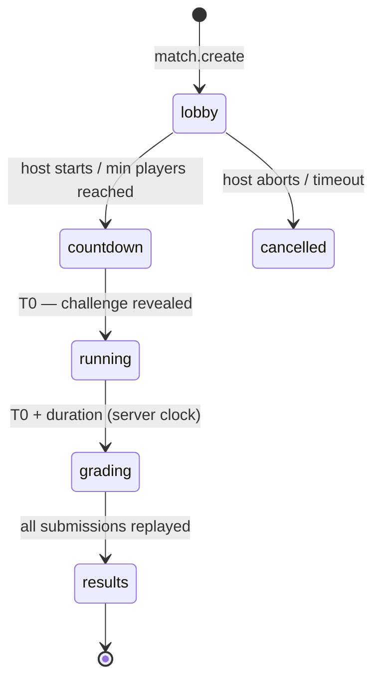

# 06 — Competitive Rounds (Multiplayer)

Format, per project decision: **all players start together, get the same challenge, and have N real minutes
to submit. Highest similarity to the target wins.** The server clock is the only authority.

## 1. Ranking metric — a distinction worth being explicit about

"Most similar to the target" is **Completion (voxel IoU)**, not `finalScore`. `finalScore` blends completion
0.6 / efficiency 0.25 / time 0.15 (`defaultChallenge.ts:87-96`), so ranking on it would silently reward
short programs over accurate haircuts — not the stated rule.

```ts
rankBy: 'completion' | 'final'      // default 'completion'
```

Make it a match setting rather than an assumption. Tie-break, announced up front and fully deterministic:

```
1. completionScore   (desc)
2. efficiencyScore   (desc)
3. estimatedDurationMs (asc)
4. server receive time of the counted submission (asc)
```

## 2. Lifecycle



- **The challenge is not revealed before T0.** It is published to the match topic at T0, not at join time.
  Sending it early — even encrypted-in-advance — is only worth doing if rounds get short; at a 5-minute
  round, MQTT delivery jitter is milliseconds against a 300-second window and is not a competitive factor.
  Do not gold-plate this.
- **Everyone gets the identical item**: the same `challengeId@challengeVersion`, and for generated items the
  same `(familyId, version, seed, params)`. Generator determinism ([`03`](03-DYNAMIC-QBANK.md) §5) is what
  makes this checkable rather than trusted.
- `grading` is usually instantaneous because submissions are replayed **as they arrive**, not at the close.

## 3. Fairness controls

| Control | Rule | Attack it stops |
| --- | --- | --- |
| Server-clock deadline | A submission counts iff **server receive time** ≤ `closesAt`. Client `ts` is ignored entirely | Clock tampering; "my machine said I was in time" |
| Hidden scores during the round | No player sees anyone's score — including their own authoritative score — until `results` | Submit → read rank → refine against a known bar |
| Resubmission allowed, best counts | Unlimited submissions until close; the server keeps the best by `rankBy` | Punishing a player for a lag spike or a bad first attempt |
| IR-only submission | Program IR is submitted; the server replays it ([`02`](02-DETERMINISM.md) §3) | Editing the score in devtools |
| Identical seeded challenge | Same item and seed for all participants, revealed at T0 | Early or easier item for some players |
| Single programming mode | The round declares servo or `cutter-grid`; a submission scored in the other is refused with `WRONG_PROGRAMMING_MODE` | Winning by picking the easier editor for that challenge |
| Membership-scoped topics | Only joined participants may subscribe to the match topic | Reading rivals' events from outside the match |
| Per-player rate limit | Cap submissions (e.g. 1 per 2 s per player) | Brute-forcing the target by flooding replays |

The rate limit matters more than it looks: because the server returns nothing during the round, a player
cannot binary-search the target — but without a cap they could still burn replay capacity for everyone.

### Why a round is single-mode

Servo and Cutter Grid are not the same task on the same challenge — Cutter Grid solves the inverse
kinematics and head avoidance for the player, which is most of what the servo version tests, and replaces it
with route-finding ([`07-CALIBRATION.md`](07-CALIBRATION.md) §11). Ranking the two against each other would
be ranking two different exercises and publishing the result as one standing, which SPEC v0.3 §15.1 rules
out.

So the mode belongs to the round, not the player: `MatchConfig.programmingMode`, declared at creation and
enforced on every submission. Two related rules fall out of it:

- **Creation fails** if the pinned challenge does not support the round's mode, and unpinned selection only
  considers challenges that do. Cutter Grid needs a certified planner profile per challenge, so most items
  are servo-only; a lobby on one of them would be a round nobody could submit into, discovered at T0.
- **`MatchResults` reports the mode**, because a table of scores is only meaningful next to the task it
  ranks.

The check reads the mode off the *scored result* — whichever engine actually produced the score — not off
the request, so a client cannot claim one mode and submit the other.

## 4. The lag disadvantage, and how to mostly remove it

A wall-clock round does disadvantage a slow machine, but **not in the way it first appears**. Building the
program in Blockly is not frame-rate sensitive. The real cost is *iteration speed*: to evaluate an attempt,
the player runs the simulation, and `SimulationTicker` advances it at real-time speed off `useFrame`
(`src/features/simulation/SimulationTicker.tsx:10-12`). A 60-second program takes 60 seconds to watch, and a
stuttering machine takes longer still because `clampFrameDeltaMs` discards anything beyond 100 ms per frame.

**Mitigation: headless fast evaluation.** The engine already accepts an injected delta, so a program can be
evaluated as fast as the CPU allows, with no rendering:

```ts
// evaluate without animating — same engine, same result
function evaluateHeadless(engine: SimulationEngine, budgetMs = 2_000): SimulationSnapshot {
  const started = performance.now();
  engine.run();
  while (engine.getSnapshot().status === 'running') {
    engine.tick(SIM_TICK_MS);                       // fixed step, no rAF
    if (performance.now() - started > budgetMs) break;   // guard
  }
  return engine.getSnapshot();
}
```

This turns "watch 60 seconds" into a few milliseconds and makes iteration count depend on *thinking speed*
rather than *frame rate*. It is also simply a better UX — a "Test" button next to "Run" — and it is the
single highest-value frontend change for a competitive format. Keep the animated run for presentation and
for watching the final attempt.

Residual, accepted disadvantage: a machine so slow that the Blockly editor itself lags. Nothing in the
protocol fixes that.

**Built.** `src/features/simulation/headlessRun.ts`, wired to the leading button in the control dock. It
uses a fixed 16 ms step rather than a frame delta, so the result of a Test does not depend on how fast the
machine drawing it happens to be, and it is bounded by a wall-clock budget so a pathological program cannot
freeze the tab. Submitting runs the same evaluation first.

## 5. Clock synchronization

Clients must render a countdown that agrees with the server's deadline.

```
match.time.req  { clientSentAt }          →
match.time.res  { clientSentAt, serverTime }  →
    rtt    = now - clientSentAt
    offset = serverTime - (clientSentAt + rtt / 2)
```

Sample 5 times, keep the sample with the **lowest RTT** (least queuing distortion), and display
`closesAt - (now + offset)`. Show a visible "closing" state in the last 10 seconds.

The countdown is a UI courtesy only. Acceptance is decided solely by server receive time, so a mis-synced
client can be surprised but cannot gain anything.

## 6. Topics and ACL

```text
hcr/v1/{t}/match/{matchId}/evt/state      → retained: phase, closesAt, participants
hcr/v1/{t}/match/{matchId}/evt/challenge  → published at T0
hcr/v1/{t}/match/{matchId}/evt/results    → published at grading completion
hcr/v1/{t}/match/{matchId}/evt/presence   → joins/leaves/disconnects
hcr/v1/{t}/u/{uid}/evt/match              → private: submission accepted/rejected, own rank at results
hcr/v1/{t}/rpc/match/{create|join|leave|submit|time}   ← client requests
```

`evt/state` being **retained** is what makes reconnection trivial: a returning player immediately receives
the phase and `closesAt` without asking.

**ACL note with an implementation consequence.** `check_subscribe` must allow
`hcr/v1/{t}/match/{matchId}/evt/#` only for joined participants, so match membership has to be reachable
from inside the ACL check. Put the membership map in the shared app state registered under `Locals`
([`04-SERVICE.md`](04-SERVICE.md) §2) — the same mechanism the broker already uses to reach the `Broker`
itself, so this adds no new plumbing.

## 7. Spectating

Spectators (non-participants) may subscribe to `evt/state`, `evt/presence` and `evt/results`, but **not** to
any participant's telemetry or program during the round — otherwise a spectator becomes a side channel to a
participant. If live spectating of runs is wanted, mirror it with a delay past `closesAt`, or restrict it to
participants who have already been eliminated.

Device telemetry mirroring for a physical arm follows the same rule: it flows through the backend bridge
([`04`](04-SERVICE.md) §8) into the watcher's own `u/{uid}/evt/` topic, never directly from a device topic.

## 8. Disconnection

- The round **never pauses** for one player. Pausing is itself an attack.
- A player who drops keeps their best submission so far; results include them.
- Reconnect restores from retained `evt/state`, then the client re-subscribes and resumes.
- A player who never submits is ranked last with `completionScore = 0`, not omitted — omission would hide
  the fact that they participated.

## 9. Grading

At close, every counted submission already has an authoritative replay result (cached by
`(challengeId, challengeVersion, programHash)`, [`04`](04-SERVICE.md) §6). Grading is therefore a sort, not
a compute:

1. Reject anything received after `closesAt`.
2. Per player, take the best submission by `rankBy`.
3. Sort with the §1 tie-break.
4. Publish `evt/results` to all participants **simultaneously** — one publish to the shared match topic, not
   per-player messages, so nobody learns their standing early.

Results carry, per player: `completionScore`, `finalScore`, `metrics`, `submissionId`, `serverReceivedAt`,
and `rank`. Publishing `serverReceivedAt` makes the deadline decision auditable after the fact, which is
what turns a disputed round into a checkable claim.

## 10. The frontend

Implemented against the HTTP binding, since MQTT is still landing. Every call goes through one interface,
`MatchProvider` (`src/services/contracts.ts`), so replacing polling with an MQTT subscription later is one
implementation rather than a UI rewrite.

| File | Role |
| --- | --- |
| `src/services/http/HttpMatchProvider.ts` | The real thing. Identity in `X-HCR-Player`, clock sync per §5. |
| `src/services/local/LocalMatchProvider.ts` | Offline **practice** against scripted bots — see the warning below. |
| `src/features/match/useMatch.ts` | Polls state, fetches the challenge at T0 and results at close. |
| `src/features/match/MatchSetup.tsx` | Host or join, round length. |
| `src/features/match/MatchLobby.tsx` | Room code, roster, the §3 rules stated to the player. |
| `src/features/match/MatchHud.tsx` | Countdown, who has submitted, accept/refuse — and no score. |
| `src/features/match/MatchScoreboard.tsx` | Standings at close, with the §1 metric named. |

The round is played in the ordinary workbench with the HUD over it: same blocks, same engine, same scoring,
so solo practice transfers to a round exactly.

> **The offline provider is not multiplayer.** With no `VITE_HCR_API_BASE_URL` there is no server, so
> nothing is replayed: the score recorded is the one the browser computed, and the opponents are generated.
> It exists because a versus mode that shows an error until somebody runs a Rust binary is a versus mode
> nobody sees. `MatchProvider.kind` is `'practice'` there and `'online'` otherwise, and the UI says which it
> is on the menu, in the lobby and on the scoreboard. A round that decides anything must be `'online'`.

## 11. Relationship to CAT

Matches and adaptive sessions are **different modes over the same machinery**, and should not be conflated:

| | CAT session | Competitive round |
| --- | --- | --- |
| Item selection | Adaptive, per learner ([`03`](03-DYNAMIC-QBANK.md)) | Identical for everyone |
| Purpose | Measure θ_solo | Rank players; also yields θ_match and item calibration |
| Timing | Untimed, learner's pace | Wall-clock deadline |
| Scoring | `finalScore` → remapped → arona | `completionScore` → ranking |

Match results **do** feed item calibration — a round is a large sample of responses to one item across the
full ability range, which adaptive testing structurally cannot produce — but must never update **θ_solo**,
since a speeded competitive setting violates the independence assumptions the ability model rests on.
Instead they estimate a separate timed ability θ_match using the same arona estimator on a δ-shifted scale.
There is deliberately **no Elo/Glicko/TrueSkill ladder**: per-round standing is the published ranking, and
nothing persistent needs defending or farming. The full treatment — including why matches may use
uncalibrated items and how δ is identified — is [`07-CALIBRATION.md`](07-CALIBRATION.md).
