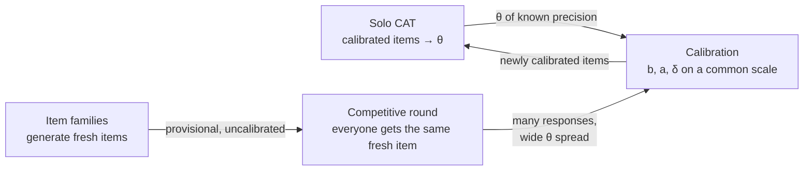

# 07 — Difficulty Updating Across Two Modes

Solo (adaptive) and match (competitive) produce responses to the **same items** under **different
conditions**. Merging them naively corrupts the bank. This document defines what updates from where.

## 1. Why the two modes are not interchangeable

| | Solo / CAT | Competitive round |
| --- | --- | --- |
| Item selection | Adaptive — chosen *because* it matches this learner's θ | Identical item for everyone, chosen before θ is known |
| θ spread per item | Narrow (only learners near `b` see it) | Wide (the whole roster sees it) |
| Time | Untimed, learner's pace | Wall-clock deadline |
| Motivation | Measurement | Winning |
| Independence | Assumed | Violated — rushing, risk-taking, strategy |

Two consequences pull in opposite directions:

- **Match data is biased.** The same item scored under a 5-minute deadline yields lower success than
  untimed. Pooling raw match responses into `b` makes every item look harder than it is, and that error
  then propagates into every solo θ estimate made with it.
- **Match data is statistically valuable.** A wide θ spread is exactly what item calibration wants; the
  narrow spread of adaptive testing is the classic weakness of CAT-collected calibration data. A single
  round produces dozens of responses to one item across the full ability range.

So the answer is neither "pool it" nor "throw it away" — it is **put both on one scale with an explicit
mode term**.

## 2. Three quantities, three update paths

The single most important table in this document:

| Quantity | Symbol | Updated by solo | Updated by match | Owner |
| --- | --- | --- | --- | --- |
| Untimed ability | θ_solo | ✅ yes (arona) | ❌ **never** | arona `Session` |
| Timed ability | θ_match | ❌ never | ✅ yes (arona, on the δ-shifted scale, §6) | arona `EAPEstimator` |
| Item difficulty | b | ✅ yes | ✅ yes, **with mode offset** | Our calibration pipeline |
| Item discrimination | a | ✅ yes | ✅ yes | Our calibration pipeline |
| Mode offset | δ | — (δ_solo ≡ 0, the anchor) | ✅ estimated | Our calibration pipeline |

**Match play never touches θ_solo.** Not because the data is worthless, but because the measurement model
does not hold there: the item was not selected for information at this learner's θ, the response is speeded,
and competitive strategy (rushing a near-miss, or coasting once a rival is clearly ahead) breaks the
independence the likelihood assumes. Match responses instead estimate a **separate** ability under time
pressure, θ_match (§6) — same library, same scale, different condition.

## 3. Common scale with a mode offset

Extend the 2PL with a condition term — the standard many-facet formulation, where "mode" is a facet
alongside person and item:

```
P(success | θ_p, item i, mode m) = 1 / (1 + exp( −a_i · (θ_p − b_i − δ_m) ))

δ_solo  ≡ 0                (solo is the reference condition — this fixes the scale)
δ_match  = estimated       (expected > 0: time pressure makes items effectively harder)
```

Read δ_match directly: "under a competitive deadline, every item behaves as if it were δ logits harder."

**Start with one global δ_match.** Only move to per-item `δ_i` when residuals justify it — and they may,
because items are not equally time-sensitive:

| Item type | Expected time sensitivity |
| --- | --- |
| `budget-squeeze` (long programs, many commands) | High — the deadline binds hardest |
| `tight-clearance` (careful, slow approach) | High |
| `uniform-trim` (few commands, forgiving) | Low |
| `asymmetric-crop` (precision, but short) | Low–medium |

A practical middle ground is `δ_i = δ_match · s_family`, one sensitivity coefficient per item family (§5 of
[`03-DYNAMIC-QBANK.md`](03-DYNAMIC-QBANK.md)) rather than per item — far fewer parameters, and it matches
the intuition that sensitivity is a property of the task *type*.

## 4. Identification: you need linking items

`b_i` and `δ_m` are **confounded for an item that only ever appears in match mode**. There is no way to tell
"this item is hard" from "matches are hard" if you only observe it in matches.

The fix is the standard common-item equating design:

> Maintain a set of **linking items** deliberately served in *both* modes to overlapping populations.
> δ_match is estimated from those, then applied to items seen only in matches.

Rules for the linking set:

- ≥ 15 items, spread across the difficulty range and across families (so `s_family` is estimable).
- Refresh it over time; a linking item that has been widely seen loses value, since prior exposure is
  itself a condition effect.
- Never generate a linking item fresh for one mode — it must genuinely appear in both.

Without linking items, the honest fallback is Option C: matches calibrate nothing.

## 5. Anchor persons: whose responses count

Calibrating `b` from match data requires knowing θ for the participants — which comes from solo CAT.

```
Include a match response in calibration iff:
    player has a solo θ estimate
    AND SE(θ) ≤ 0.40                    (precise enough to serve as an anchor)
    AND the item was unseen by that player before the round
    AND the player actually submitted (a non-submission is not a failed attempt)
```

Everyone else is still ranked normally — they just do not contribute to item calibration. This is the
classic "known-ability anchor persons" design, and it is why solo and match are complementary rather than
redundant: **solo measures people, matches measure items.**

## 6. Competitive standing without a separate rating system

**No Elo / Glicko / TrueSkill.** Everything stays inside arona and our own stack. That is not just a
dependency preference — for this game it is also the better model.

An Elo-family system compares players to *opponents* and treats the task as noise. But in an HCR round every
participant faces the **identical item**, and we know that item's difficulty. Elo would discard exactly the
information we already have. IRT uses it: beating a hard item says more than beating an easy one, and the
model already knows the difference.

So competitive ability is estimated with **the same arona machinery**, on the δ-shifted scale:

```rust
// θ_match: ability under time pressure. Same estimator, difficulties shifted by the mode offset.
let mut est = EAPEstimator::new(0.0, 1.0);
// each match response contributes an item whose difficulty is (b_i + δ_i), not b_i
let theta_match = est.update(&match_state);
```

Properties this buys over a rating system:

- **One scale, two conditions.** θ_solo and θ_match are both person ability in logits. Their difference is
  that player's cost of the clock — directly interpretable feedback: *"untimed you are at 1.2, under a
  deadline 0.7; you lose 0.5 logits to time pressure."* No rating system produces that.
- **No new dependency, no second concept to explain.** `EAPEstimator` is already in use for solo.
- **Uncertainty comes free.** EAP reports a standard error, which is what rating deviation exists to
  approximate.
- **Round difficulty is handled correctly.** A round on a hard item and a round on an easy one contribute
  appropriately, instead of both being "a win".

Per-round standing is just the ranking published in `match.results.evt`
([`06-MULTIPLAYER.md`](06-MULTIPLAYER.md) §9) — an event result, not a ladder position. There is no
persistent cross-round rating to maintain, defend, or farm.

**Do not display θ_solo and θ_match as one number.** They answer different questions, and collapsing them
would hide the most useful thing the pair tells a learner. A player who has never done a solo assessment
simply has no θ_solo — that is a reason to invite them to take one, not to synthesize one from matches.

## 7. The loop this creates

The two modes feed each other, which resolves the cold-start problem in
[`03-DYNAMIC-QBANK.md`](03-DYNAMIC-QBANK.md) §7:



The key enabling fact: **a match does not need a calibrated item to be fair.** Ranking is internally valid
whatever `b` turns out to be, because every participant faces the identical item. So matches can consume
`provisional` items freely — and in doing so they generate precisely the wide-spread response data that
calibration needs and that adaptive testing structurally cannot produce.

That also means item generation is not a nice-to-have here. A competitive round needs an item **unseen by
every participant** (§8), and once a player base has been active for a while, the supply of unseen
calibrated items runs out. Generation is what keeps rounds fair.

## 8. Item selection for a match ≠ selection for CAT

Different objective, so a different rule:

| | Solo CAT | Match |
| --- | --- | --- |
| Objective | Maximize information at one θ | Maximize *ranking* information across the roster |
| Rule | `argmax_i I_i(θ)` | `argmax_i Σ_p I_i(θ_p)` over participants |
| Hard constraint | Not seen by this learner | **Not seen by ANY participant** |
| Calibration required | Yes — `calibrated` or `online` | No — `provisional` is fine |

An item where predicted success is near 0 or near 1 for everyone produces no ranking at all: the round ends
in a mass tie and tells you nothing. Targeting `b ≈ median(θ_roster)` is the cheap approximation of the
`Σ_p I_i(θ_p)` rule and is usually sufficient.

The "unseen by any participant" constraint deserves emphasis — a participant who has already attempted the
item solo has both the answer shape and the muscle memory. Track a per-player seen-set and intersect it
across the roster before selecting.

## 9. Guardrails

| Risk | Detection | Response |
| --- | --- | --- |
| δ_match drifts (format or duration changed) | Monitor δ per round-duration bucket | Estimate δ per duration band; a 3-minute round is not a 10-minute round |
| Match data swamps solo data for an item | Track response counts by mode | Cap match responses' weight in the fit, or down-weight by mode |
| Linking set becomes over-exposed | Exposure rate on linking items | Rotate the linking set on a schedule |
| A generated item turns out to be impossible | Everyone scores ~0 in the round | Auto-retire; the round still ranks (all tie) but flag it as a wasted round |
| Anchor persons unrepresentative | Compare anchor θ distribution to roster | Widen the SE threshold, or defer calibration until coverage improves |
| Competitive strategy contaminating scores | Residual analysis by rank position | Consider excluding responses from players already mathematically eliminated |

## 10. What arona can and cannot do here

| Need | arona | Where it lives |
| --- | --- | --- |
| θ_solo estimation | ✅ `EAPEstimator` | arona |
| θ_match estimation | ✅ same `EAPEstimator`, fed δ-shifted difficulties | arona — no new machinery |
| Fisher information at a θ | ✅ `IRTParameters::information` | arona — reused for both selection rules |
| Item difficulty calibration | ❌ none | Ours |
| Mode offset δ | ❌ no condition facet; `probability()` takes only `Ability` | Ours (shift `b` before handing it to arona) |
| Multi-group / facets model | ❌ | Ours |

Note how δ slots in without fighting the library: arona never needs to know a mode exists. We shift the
difficulty *before* constructing `IRTParameters`, and arona does ordinary unidimensional IRT on whichever
scale we hand it.

This is workable precisely **because arona is only used for solo CAT.** Matches never call into it, and
calibration was already outside it ([`03`](03-DYNAMIC-QBANK.md) §10). So the mode offset lives entirely in
our layer, and arona is simply handed the solo-scale `b` it expects:

```rust
// Feed arona the SOLO-scale difficulty. Never the match-contaminated value.
IRTParameters::new(
    Discrimination(item.a),
    Difficulty(item.b_solo),      // b on the reference scale, δ_solo ≡ 0
    GuessingParam(0.0),
)
```

Getting that one line wrong — passing a difficulty estimated from match data into the solo bank — is the
single most likely way to silently corrupt every ability estimate in the system. It deserves a named
constructor and a test.
