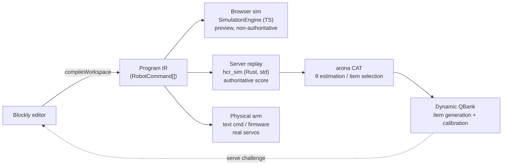

# HCR Simulator — Backend & Contract Design (vNext draft)

> **Status: design draft, not authorized for implementation.**
> SPEC v0.3 forbids MQTT / ESP / real network dependencies in v1 (`AGENTS.md`, "v1 prohibitions" section),
> and lists CAT / Dynamic QBank, backend protocol, and real ESP/MQTT as future extensions / TBD (SPEC v0.3 §15).
> This directory answers *how it should be built when the time comes*. It does **not** modify `src/`.
>
> SPEC v0.3 §15 imposes a hard constraint that this design obeys throughout: new capabilities may only
> arrive as **new config, new interface implementations, or versioned protocol extensions** — they must not
> break the existing semantics of Program IR, Provider, or Score Result.

## Documents

| Doc | Contents |
| --- | --- |
| [`01-CONTRACT.md`](01-CONTRACT.md) | The contract: envelope, MQTT topic binding, MQTT-over-WebSocket for the browser, message schemas, error model, auth, idempotency |
| [`02-DETERMINISM.md`](02-DETERMINISM.md) | Determinism & authoritative scoring: the frame-rate bug, canonical tick, server-side replay, cross-language conformance vectors |
| [`03-DYNAMIC-QBANK.md`](03-DYNAMIC-QBANK.md) | arona CAT integration & the dynamic question bank: IRT mapping, custom `QuestionBank`, item-family generation, difficulty model, calibration, exposure control |
| [`04-SERVICE.md`](04-SERVICE.md) | hotaru backend: crate layout, HTTP + MQTT + WebSocket assembly, broker auth, session actors, replay pool |
| [`05-EMBEDDED.md`](05-EMBEDDED.md) | The real ESP8266 arm, the staged path to a Rust/embassy/hotaru firmware, joint mapping, safety |
| [`06-MULTIPLAYER.md`](06-MULTIPLAYER.md) | Competitive wall-clock rounds: fairness controls, server-clock deadlines, lag mitigation, grading |
| [`07-CALIBRATION.md`](07-CALIBRATION.md) | How difficulty updates across both modes: common scale + mode offset, linking items, anchor persons, competitive rating |
| [`08-CUTTER-GRID.md`](08-CUTTER-GRID.md) | Cutter Grid: why its trajectory is verified rather than replayed, what the server re-derives, the trust boundary and the challenge signature |
| [`schema/hcr-v1.d.ts`](schema/hcr-v1.d.ts) | **Normative** type definitions (TypeScript; the frontend can adopt directly) |
| [`schema/hcr_v1.rs`](schema/hcr_v1.rs) | Rust DTO mirror of the same schema |

## 1. The spine: one IR, three executors

There is exactly one organizing idea — **Program IR is the single source of truth** — consumed by three
mutually distrusting executors:

Everything else follows from this:

- Program IR is already frozen in v1 (`src/features/blockly/programTypes.ts`); the contract **reuses** it verbatim.
- Server and firmware share one Rust simulation core (`hcr_sim`, `no_std + alloc`).
- Score authority lives in server replay, not in whatever the browser reports (see §3).

## 2. Verified capability matrix

Based on source inspection of all three repos, not on their documentation.

### arona (CAT engine)

| Finding | Evidence |
| --- | --- |
| Complete CAT loop: `Session::new` → `next_question` → `submit_response` → `finalize` | `arona/src/session/session.rs:196,445,533,670` |
| 1PL / 2PL / 3PL, all dichotomous | `arona/src/core/irt.rs:161,259,350` |
| MLE / EAP / SimpleAverage estimators; **MAP not implemented** | `arona/src/estimation/traits.rs:19` |
| `QuestionBank` is object-safe, only 3 required methods | `arona/src/qbank/traits.rs:210-300` |
| **std-only** — no `#![no_std]`, no feature flags, uses `std::time` / `HashMap` / `thread_rng` | `arona/Cargo.toml`, `qbank/static_bank.rs:435` |
| **No serde on domain types**; `Question` has no ID and is not `Clone` | `arona/src/core/question.rs:200-220` |
| **No GPCM, no MIRT** — `Score` is `[0,1]` but every estimator binarizes at `is_correct()` (>0.5) | `arona/src/core/score.rs:143` |
| **No exposure control**; `used_types` is never read by `StaticQBank` | `arona/src/qbank/static_bank.rs:146,234` |
| `StaticQBank` is fixed at construction — no add/remove | `arona/src/qbank/static_bank.rs:191` |

⇒ arona runs **only in the std backend**. Dynamic pooling, exposure control, calibration, and persistence
are all ours to build. The good news: `QuestionBank` being object-safe means a custom bank is the
officially intended extension point.

### hotaru / hotaru_mqtt

| Finding | Evidence |
| --- | --- |
| MQTT client is **no_std-capable** (`async-channel` / `event-listener` / `OnceBox` instead of tokio primitives) | `hotaru_mqtt/hotaru_mqtt/src/lib.rs:19` |
| **Broker is std-only** | `hotaru_mqtt/hotaru_mqtt_broker/Cargo.toml` |
| Implements MQTT **3.1.1 and 5.0** (README undersells it as 3.1.1) | `hotaru_mqtt/hotaru_mqtt/src/packet.rs:34-59` |
| QoS 0/1/2 including the full QoS-2 handshake | `hotaru_mqtt/hotaru_mqtt/src/protocol.rs:770-797` |
| HTTP and MQTT **coexist on one port** in a single protocol registry | `hotaru_mqtt_broker/tests/integration.rs:1910-1916` |
| Broker is fail-closed by default; pluggable `Authenticator` / `AclChecker` / `TenantResolver` / `RetainedStore` / `SessionStore` | `hotaru_mqtt_broker/src/broker.rs:304`, `src/traits.rs:66-215` |
| **Protocol upgrade exists**: `ConnectionStatus::SwitchProtocol(TypeId)`, `serve_upgrade(...)`, HTTP `101` / `426` | `hotaru_core/src/connection/connection.rs:9-25`, `executable/entry/traits.rs:34-42` |
| No WebSocket framing implementation ships today (the `h2per` WS code is in an excluded, stale crate) | `hotaru/Cargo.toml:20` excludes `h2per` |
| Embedded path: `hotaru_rt_embassy` + `hotaru_io_embedded`, built separately (std/no_std `compile_error!`) | `hotaru/Cargo.toml:33-58` |

⇒ **MQTT-over-WebSocket is reachable without touching `hotaru_mqtt`.** `MqttServerProtocol<W, TS, Rt>` is
generic over the stream type, so a new `ConnStream` implementation that does RFC 6455 framing is the entire
delta. See [`04-SERVICE.md`](04-SERVICE.md) §3.

### Frontend (`src/`)

| Finding | Evidence |
| --- | --- |
| The backend seam already exists and is async: `ChallengeProvider` / `ScoreProvider` | `src/services/contracts.ts:8-15` |
| Providers are injected via React context; swapping implementations needs no UI/engine change | `src/app/providers.tsx:9-12` |
| Currently **zero network code** (no fetch/env/URL config anywhere in `src/`) | repo-wide search |
| Reserved-but-unimplemented REST endpoints are already in the spec | `docs/HCR_Simulator_SPEC_v0.3.md:528-531` |
| Simulation advances on render frames — `tick(deltaMs)` from `useFrame` | `src/features/simulation/SimulationTicker.tsx:10-12` |

⇒ The HTTP binding deliberately mirrors those two interfaces, so `HttpChallengeProvider` /
`HttpScoreProvider` drop straight in at the composition root. That is how §15's "don't break existing
semantics" is satisfied in practice.

### The physical arm (`ESP8266.ino`)

| Finding | Evidence |
| --- | --- |
| **ESP8266** + Arduino, seller-supplied; 4/5/6-axis arm kit | `ESP8266.ino:39,33-35` |
| `ss = 5` active axes named `X, Y, Z, B, E` (base → gripper), 6th `T` spare | `ESP8266.ino:92-94` |
| Servo range **0–180°**, home at **90°**; `Min/Max` per axis, `E` limited to `45..100` | `ESP8266.ino:95-99` |
| PWM 500–2500 µs via `toPWM` / `Servo.attach(pin,500,2500)` | `ESP8266.ino:127-138,425` |
| **Text command language**: `X 50;Y +10;Z -10`, `H` home, `?` query → `{"X":90,...,"Cmd":0}` | `ESP8266.ino:741-745,388-402` |
| Full verb list: `? ？ sync DIR format RE Stop Start Time SH F C S D delay H Test step XYZ R /` plus per-axis `X Y Z B E T` | `ESP8266.ino:826-1163` |
| Transports today: HTTP :80, TCP :8000 (can also **dial out** to a remote server), UDP :8888, Serial, Blinker cloud | `ESP8266.ino:540-552,594-596` |
| **No MQTT anywhere in the firmware** | repo-wide search of `ESP8266.ino` |
| Moves are blocking with `delay()`; long loops need `yield()` or the soft WDT reboots the board | `ESP8266.ino:168,177-180` |

⇒ The hardware does not speak MQTT and cannot practically run Rust (esp-hal/embassy do not target the
ESP8266's Xtensa LX106). The embedded plan is therefore **staged** — see [`05-EMBEDDED.md`](05-EMBEDDED.md).

## 3. Why the server scores, and what the frame-rate effect really is

> An earlier draft of this section called frame-rate dependence a blocking correctness issue. Worked through
> with the real constants, that was wrong. Corrected below; full arithmetic in
> [`02-DETERMINISM.md`](02-DETERMINISM.md) §1–2.

**The frame-rate effect exists but the voxel grid absorbs it.** Contact detection evaluates one straight
chord per tick against an AABB expanded by `size/2 + toolRadius = 0.08 + 0.12 = 0.20` — a test box 2.5
voxels wide (`defaultChallenge.ts:68,79`). The chord-vs-arc sagitta at worst-case lever arm (`r ≈ 2.3`,
`baseYaw` 60 °/s):

| Frame rate | Sagitta | % of a voxel | Expected differing voxels / 1-unit sweep |
| --- | --- | --- | --- |
| 60 Hz | 0.000088 | 0.05 % | ~0.03 |
| 30 Hz | 0.00035 | 0.22 % | ~0.1 |
| 10 Hz (100 ms clamp) | 0.0032 | 2.0 % | ~1 |

So at interactive frame rates the difference is a fraction of one block; only a throttled tab reaches a
single voxel, worth ~0.2 points of Final Score. **Not a correctness problem.**

**The collision claim was simply wrong.** `advanceAngleWithConstraint` always sub-steps at ≤0.5° regardless
of tick size and then runs 12 bisections, converging to the true geometric boundary within ~0.0001°
(`RobotController.ts:181-215`). `safeAngleDeg` does not drift with frame rate.

**What does justify server-side scoring is trust, not determinism.** The client is JavaScript in a browser
the player controls: in a ranked competition, the score, the voxel set and the metrics can all be edited in
devtools before submission. The fix is that the client submits **Program IR** and the server replays it —
which also makes every historical score re-derivable from `(challengeId, challengeVersion, program)`, the
property CAT calibration and dispute handling need. The local run stays exactly as it is: a live preview.

Consequently the canonical fixed timestep is **optional**, not a prerequisite, and no frontend change is
required to proceed.

## 4. Key decisions

| # | Decision | Rationale | Cost |
| --- | --- | --- | --- |
| D1 | Browser speaks **MQTT over WebSocket**; devices speak native MQTT over TCP | Per project direction, MQTT is the transport. `MqttServerProtocol` is stream-generic, so this needs only a new `ConnStream` | We must implement RFC 6455 framing (~the largest new component) |
| D2 | One message semantics, two encodings: JSON for browser, compact text/CBOR for devices | MCUs should not parse large JSON | Schema must stay in sync across encodings |
| D3 | Submit **Program IR (`nodes`)**, never `runtimeCommands` | Server expands `repeat` itself and enforces the 500-command cap; prevents a client submitting an expansion that doesn't match its IR | Server must reimplement `programCompiler` expansion |
| D4 | Authoritative score = server replay | The client is untrusted and editable (§3); replay also makes every score re-derivable for calibration and disputes | Requires the Rust sim core |
| D5 | Custom `QuestionBank` impl instead of `StaticQBank` | Dynamic pool, exposure control, blueprint, and item generation are all outside arona | We write the selection algorithm (reusing `IRTParameters::information`) |
| D6 | `itemRef` is an HMAC-signed opaque token | arona identifies items by `Vec` index and `Question` has no ID; the token solves ID mapping *and* tamper resistance | Key management |
| D7 | Device topics split into `up/` and `dn/` subtrees | ACL collapses to two prefix rules — hard to get wrong | Slightly longer topics |
| D8 | Item versioning (`challengeVersion`), pinned per session | Recalibrating IRT parameters must not retroactively move historical scores | Versioned storage |
| D9 | Physical arm integrated via a **gateway** first, native firmware later | The ESP8266 has no MQTT and no viable Rust toolchain | Gateway is a translation layer that eventually gets retired |
| D10 | Competitive rounds rank on **`completionScore`**, not `finalScore` | The rule is "most similar to the target"; `finalScore` blends in efficiency and time and would reward short programs over accurate ones | `rankBy` is a match setting, so both remain available |
| D11 | Round deadline decided by **server receive time**; scores hidden until close | Client clocks are untrusted; visible scores let a player refine against a known bar | Needs clock-sync RPC so countdowns look right |
| D12 | Solo and match share **one difficulty scale via a mode offset δ**; match play never updates θ_solo | Time pressure makes items behave harder; pooling raw match data would inflate every `b` and corrupt solo θ. δ keeps both modes on one scale | Requires a linking-item set served in both modes to identify δ |
| D14 | **No Elo/Glicko/TrueSkill.** Competitive ability is θ_match, estimated with arona's own `EAPEstimator` on the δ-shifted scale | Everything stays in one framework and one stack. It is also the better model here: every player faces the identical item of known difficulty, which a rating system would discard. Yields interpretable output — the θ_solo − θ_match gap is a learner's cost of the clock | No persistent ladder; per-round standing is just the published ranking |
| D13 | Matches may use **uncalibrated (provisional) items**; solo may not | Ranking is valid whatever `b` is, since everyone faces the identical item. This makes matches the calibration engine for the solo bank | Per-player seen-sets must be intersected across the roster |

## 5. Non-goals and open questions

**Non-goals:** billing/classroom/leaderboard product features; real barbering process parameters (the
geometry stays v1's ellipsoid head + voxel hair); physics engine, arm self-collision, IK.

**Open questions requiring a decision:**

1. ~~**`hotaru_core` version skew.**~~ **RESOLVED 2026-07-31.** `hotaru_mqtt` asked `hotaru_core` for a
   feature `full` that commit `da81186` ("CI tests", 2026-07-13) renamed to `full_regex`
   (`full = ["regex/unicode"]` → `full_regex = ["dep:regex", "regex/unicode"]`). Fixed in two places —
   `hotaru_mqtt/Cargo.toml` `std` feature and `hotaru_mqtt_broker/Cargo.toml` — after which the whole
   `hotaru_mqtt` workspace builds and all 188 of its tests pass. **Uncommitted** in the `hotaru_mqtt`
   checkout; worth upstreaming.

   Building the embedded profile then surfaced a second, unrelated defect:
   `hotaru_mqtt` compiles under `embedded,spawn_send` but **not** `embedded,spawn_local`, because
   `hotaru_core`'s `Channel` trait hardcodes `Send + Sync` instead of the `MaybeSend`/`MaybeSync` markers
   it already ships. Not blocking — see [`05-EMBEDDED.md`](05-EMBEDDED.md) §6.
2. **The `shoulderRoll` mismatch.** The simulator has a `shoulderRoll` joint the physical arm lacks, and the
   arm has a gripper `E` the simulator lacks. Either constrain hardware-bound challenges to `shoulderRoll = 0`,
   add a 6th servo, or accept that some challenges are simulation-only. Product decision — see
   [`05-EMBEDDED.md`](05-EMBEDDED.md) §3.
3. **Partial credit.** HCR tasks produce continuous scores; arona binarizes at 0.5.
   [`03-DYNAMIC-QBANK.md`](03-DYNAMIC-QBANK.md) §2 gives an order-preserving remap as a workaround; the real
   fix is GPCM, an upstream gap in arona.
4. **Multidimensional ability.** arona has a scalar θ. Single composite θ, or parallel unidimensional
   sessions per skill? Options and a recommendation in [`03-DYNAMIC-QBANK.md`](03-DYNAMIC-QBANK.md) §6.
5. **Physical safety.** The simulator's head-collision geometry is **not** a safety system. Any deployment
   that puts this arm near a real person's head needs a hardware interlock independent of software. Out of
   scope here, stated explicitly in [`05-EMBEDDED.md`](05-EMBEDDED.md) §7.
